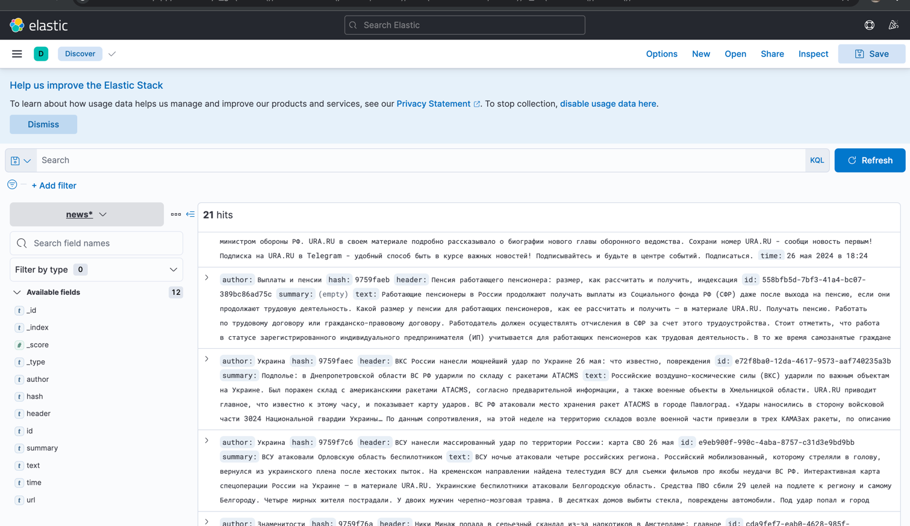

# Java Web Crawler

## Stack

- Elasticsearch 7.17.19 (библиотека v8.8.0)
- Kibana 7.17.19
- Java 21
- Jsoup 1.10.2 (lib)
- RabbitMQ 5.20.0 (lib)

### Run enviroment in docker
```
docker-compose -f docker/docker-compose.yml up -d
```

### Stop 
```
docker-compose -f docker/docker-compose.yml down
```

### ElasticSearch


### RabbitMQ


# Queries and Aggregations
### 1. OR Query
```
POST /news/_search
{
  "query": {
    "bool": {
      "should": [
        {"match": {"time": "26 мая"}},
        {"match": {"text": "Тбилиси"}}
       ]
    }
  }
}
```

### 2. AND Query
```
POST /news/_search
{
  "query": {
    "bool": {
      "must": [
        {"match": {"time": "26 мая"}},
        {"match": {"text": "Тбилиси"}}
       ]
    }
  }
}
```

### Script Query
```
POST /news/_search
{
  "query": {
    "script_score": {
      "query": {"match_all": {}},
      "script": {
        "source": "return doc['author'].value.length() "
      }
    }
  }
}
```

### MultiGet Query
```
GET /news/_mget
{
  "docs": [
    { "_id": "LMTNtY8BB4R44BnSc0GK" },
    { "_id": "PcTNtY8BB4R44BnSiUHe" }
  ]
}
```

### Histogram Aggregation
```
POST /news/_search
{
  "aggs": {
    "header_length_histogram": {
      "histogram": {
        "script": {
          "source": "doc['header'].value.length()",
          "lang": "painless"
        },
        "interval": 1
      }
    }
  }
}
```

### Terms Aggregation
```
POST /news/_search
{
  "aggs": {
    "popular_authors": {
      "terms": {
        "field": "author"
      }
    }
  }
}
```

### Filter Aggregation
```
POST /news/_search
{
  "aggs": {
    "filtered_body": {
      "filter": {
        "term": {"author": "Ольга Тарасова"}
      },
      "aggs": {
        "avg_summary_length": {
          "avg": {
            "script": {
              "source": "doc['url'].value.length()",
              "lang": "painless"
            }
          }
        }
      }
    }
  }
}
```

### Logs Aggregation
```
GET /logstash*/_search
{
  "size": 0, 
  "aggs": {
    "streams": {
      "terms": {
        "field": "stream.keyword",
        "size": 10
      }
    }
  }
}
```